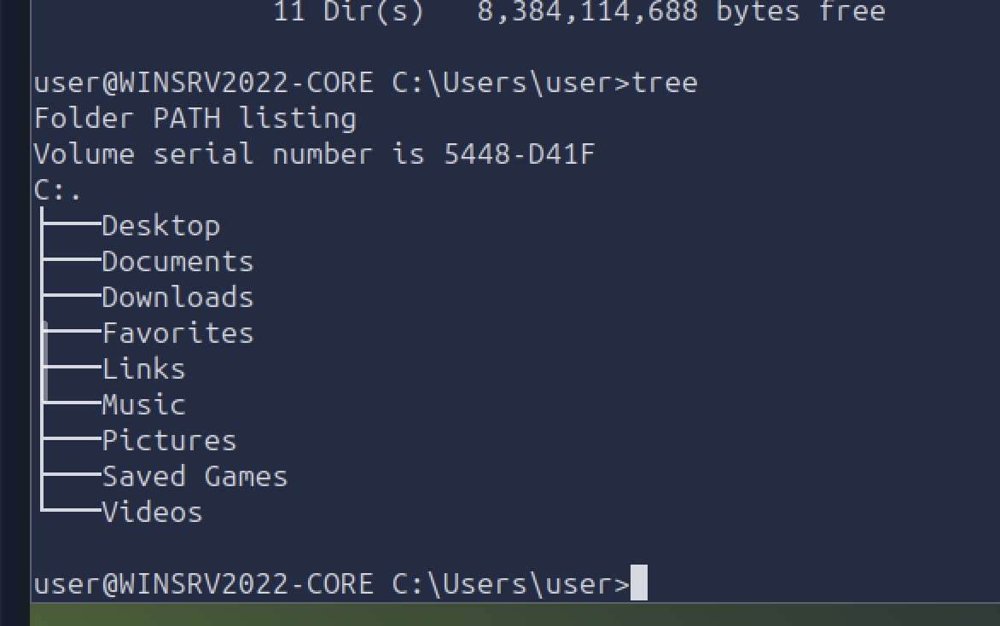
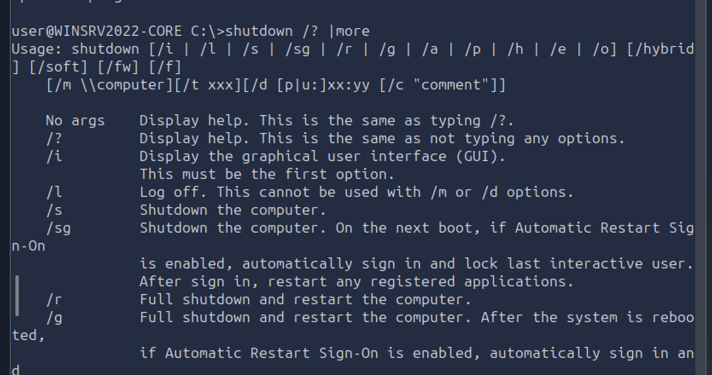

# Windows Command Line: Part 1

## Why Use Command Line Interface (CLI) Over GUI?

- ⚡ **Speed** - Faster execution of tasks
- 📈 **Efficiency** - Accomplish more with fewer steps
- 💾 **Lower Resource Usage** - Minimal memory and CPU consumption
- 🤖 **Automation** - Script repetitive tasks
- 🌐 **Remote Management** - Manage systems over network connections

---

## System Information Commands

### Ver
Display Windows version information.
```powershell
ver
```

### Systeminfo
List comprehensive system details including OS info, processor, memory, and hardware specifications.
```powershell
systeminfo
```

---

## Network Troubleshooting Commands

### Ipconfig
Show current network configuration.
```powershell
ipconfig
```

### Ipconfig /All
Display detailed network information including MAC address, DHCP settings, and DNS servers.
```powershell
ipconfig /all
```

### Ping
Check whether a connection to a host can be established.
```powershell
ping (target_name)
ping google.com
```

### Tracert
Display the route/path your data takes to reach a destination, showing each hop.
```powershell
tracert (target_name)
tracert google.com
```


*Network path visualization showing route to destination*

### Nslookup
Look up a host or domain name and return its IP address.
```powershell
nslookup google.com
```

### Netstat
Display current network connections and listening ports.
```powershell
netstat
```

### Netstat -Abon
Show detailed network statistics including process IDs and associated applications.
```powershell
netstat -abon
```

---

## File Management Commands

### Dir
List child directories and files in current location.
```powershell
dir
```


*Navigating and listing directories*

### Dir /A
Display hidden files and directories along with normal ones.
```powershell
dir /a
```

### Copy
Copy files from one location to another.
```powershell
copy (source) (destination)
copy file.txt C:\backup\
```

---

## Process Management Commands

### Tasklist
Display all currently running processes with their Process IDs (PIDs).
```powershell
tasklist
```


*List of active processes running on the system*

### Taskkill
Terminate a running process by name or Process ID.
```powershell
taskkill /im (process_name)
taskkill /pid (process_id)
```

---

## System Management Commands

### Shutdown
Control system shutdown and restart operations.
```powershell
shutdown /s    # Shutdown
shutdown /r    # Restart
shutdown /h    # Hibernate
```


*Shutdown command options and parameters*

---

## Key Takeaways

✅ CLI provides faster and more efficient system management  
✅ Network troubleshooting tools help diagnose connectivity issues  
✅ Process management allows control of running applications  
✅ File operations can be automated via command line  
✅ System information commands provide detailed diagnostics  

---
# Windows PowerShell: Part 2
powershell is a cross-platform task automation solution made up of a command line shell.
combines a command line interface and a scripting language built on the Net Framework
pwoershell can handle complex data types and interact with system componenets more effictively
The purpose of powershell is to overcome the limitations of existing command line tools and scripting environments in windows.
object-oriented, advanced apporach used to develop Powershell
powershell basics
PowerShell commands are known as cmdlets (pronounced command-lets). They are much more powerful than the traditional Windows commands and allow for more advanced data manipulation.
Cmdlets follow a consistent Verb-Noun naming convention. This structure makes it easy to understand what each cmdlet does. The Verb describes the action, and the Noun specifies the object on which action is performed.
Get-Command. It’s an essential tool for discovering what commands one can use.
PS C:\Users\captain> Find-Module -Name "PowerShell*"   

Version    Name                                Repository           Description 
-------    ----                                ----------           ----------- 
0.4.7      powershell-yaml                     PSGallery            Powershell module for serializing and deserializing YAML

2.2.5      PowerShellGet                       PSGallery            PowerShell module with commands for discovering, installing, updating and publishing the PowerShell artifacts like Modules, DSC Resources, Role Capabilities and Scripts.                                                   
1.0.80.0   PowerShell.Module.InvokeWinGet      PSGallery            Module to Invoke WinGet and parse the output in PSOjects

0.17.0     PowerShellForGitHub                 PSGallery            PowerShell wrapper for GitHub API  

Get-ChildItem lists the files and directories in a location specified with the -Path parameter. It can be used to explore directories and view their contents.
To navigate to a different directory, we can use the Set-Location cmdlet. It changes the current directory, bringing us to the specified path, akin to the cd command in Command Prompt
To create an item in PowerShell, we can use New-Item
 to read and display the contents of a file, we can use the Get-Content cmdlet
 Piping is a technique used in command-line environments that allows the output of one command to be used as the input for another.
 The operator -eq (i.e. "equal to") is part of a set of comparison operators that are shared with other scripting languages (e.g. Bash, Python). To show the potentiality of the PowerShell's filtering, we have selected some of the most useful operators from that list:

-ne: "not equal". This operator can be used to exclude objects from the results based on specified criteria.
-gt: "greater than". This operator will filter only objects which exceed a specified value. It is important to note that this is a strict comparison, meaning that objects that are equal to the specified value will be excluded from the results.
-ge: "greater than or equal to". This is the non-strict version of the previous operator. A combination of -gt and -eq.
-lt: "less than". Like its counterpart, "greater than", this is a strict operator. It will include only objects which are strictly below a certain value.
-le: "less than or equal to". Just like its counterpart -ge, this is the non-strict version of the previous operator. A combination of -lt and -eq.
Get-ComputerInfo cmdlet retrieves comprehensive system information, including operating system information, hardware specifications, BIOS details, and more
Get-LocalUser lists all the local user accounts on the system. The default output displays, for each user, username, account status, and description.
Get-NetIPConfiguration provides detailed information about the network interfaces on the system, including IP addresses, DNS servers, and gateway configurations.
Get-NetIPAddress cmdlet will show details for all IP addresses configured on the system, including those that are not currently active.
Get-FileHash as a useful cmdlet for generating file hashes, which is particularly valuable in incident response, threat hunting, and malware analysis, as it helps verify file integrity and detect potential tampering.
Scripting is the process of writing and executing a series of commands contained in a text file, known as a script, to automate tasks that one would generally perform manually in a shell, like PowerShell.
system administrators benefit from PowerShell scripting for automating integrity checks, managing system configurations, and securing networks, especially in remote or large-scale environments. PowerShell scripts can be designed to enforce security policies, monitor systems health, and respond automatically to security incidents, thus enhancing the overall security posture.
Progress pic:

**Last Updated:** 2026-09-15  
**Status:** 📚 Active Learning
