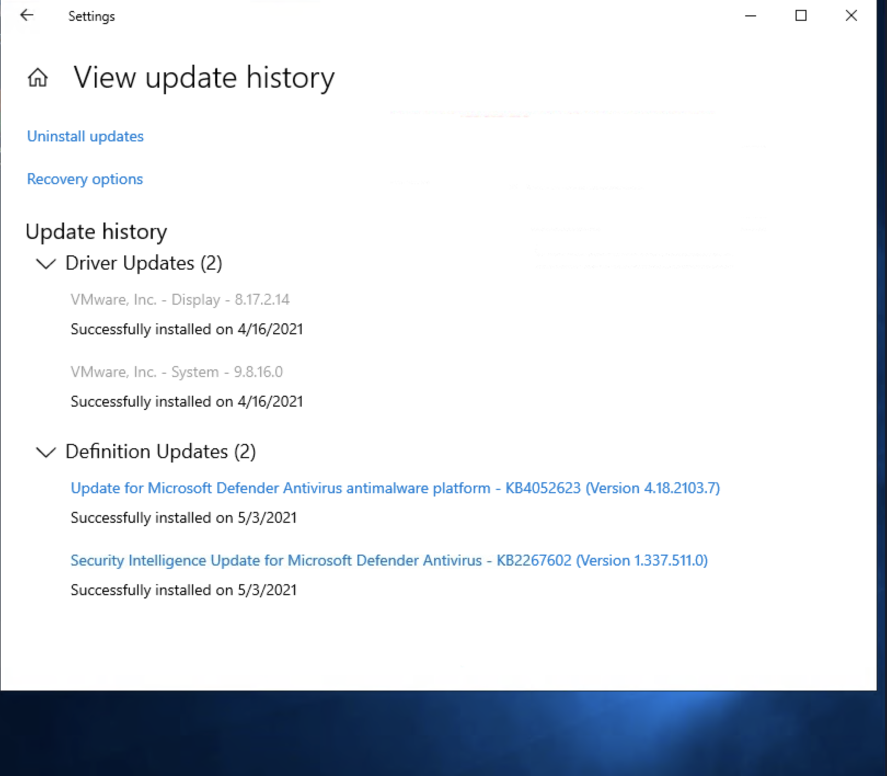
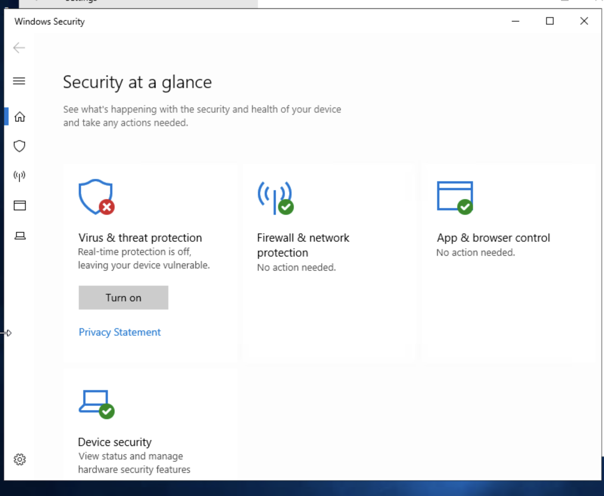
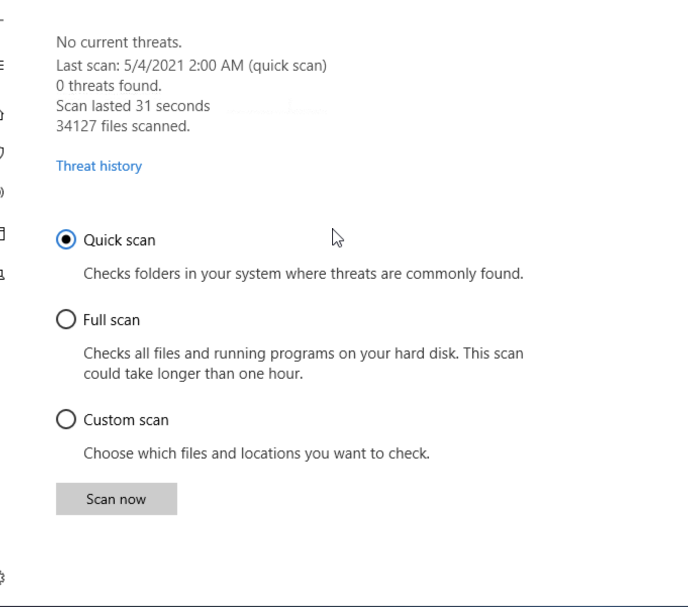
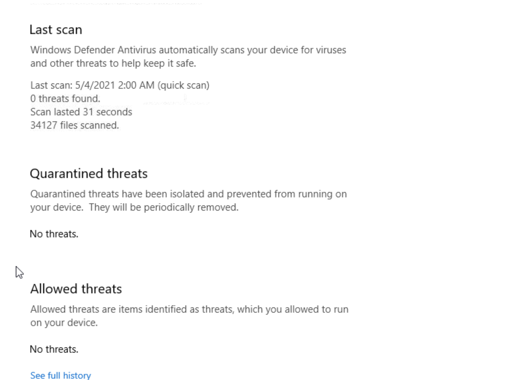
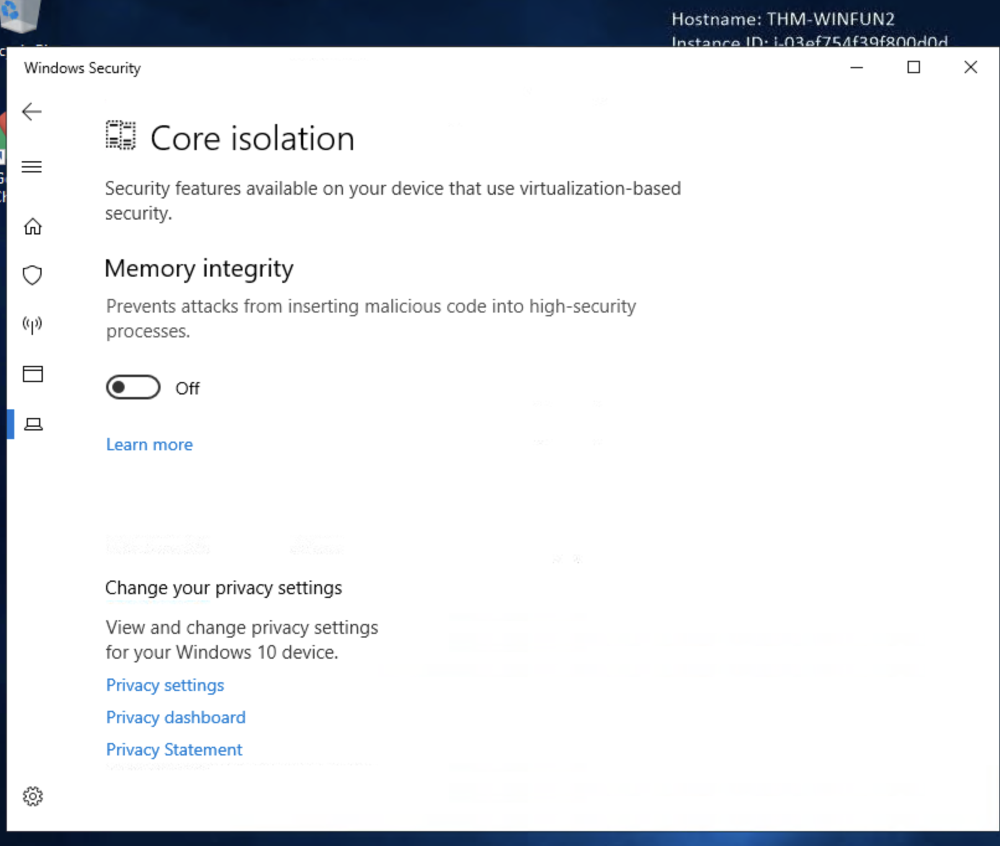

# Windows Fundamentals

## Part 1: File System & Security(11/9/2026)

### NTFS (New Technology File System)

Currently uses **NTFS** instead of FAT or HPFS

**Features:**
- Supports files larger than 4GB
- Set specific permissions on folders and files
- Folder and file compression
- Encryption (Encryption File System - EFS)

### File Permissions

**How to view permissions:**
1. Right-click file/folder
2. View Properties
3. Click on Security tab
4. View permissions and group/user names

### ADS (Alternate Data Streams)

| Aspect | Description |
|--------|-------------|
| Definition | Every file has at least one ADS |
| Purpose | Allows files to contain more than one stream of data |
| Visibility | Windows Explorer doesn't display ADS to users |
| Viewing Tools | 3rd party executables, PowerShell |
| Security Risk | Malware writers use ADS to hide data (hidden HTML tags) |

### System32

- Holds important files that are critical for the operating system

### User & Group Management

**Access via Run:**
- Command: `lusrmgr.msc`
- Shows users and groups
- Displays brief description for each group

### UAC (User Account Control)

- Reduces likelihood of malware successfully compromising your system

---

## Part 2: System Configuration & Management(12/9/2026)

### System Configuration (MSConfig)

**Access via Run:** `MSConfig`

| Tab | Description |
|-----|-------------|
| Services | Lists all services configured for system (running or stopped) |
| Tools | Tools to configure the operating system further |

### Advanced System Settings

**To access:**
1. Open MSConfig
2. Click "View Advanced System Setting"
3. Opens System Properties panel

### UAC Settings Levels

| Level | Description |
|-------|-------------|
| **Always notify** | Highest security - Windows notifies whenever any apps or you try to make changes. Desktop dims (Secure Desktop) |
| **Notify for apps** | Windows notifies only when apps try to make changes, not when you change Windows settings. **Default setting** |
| **Notify without dimming** | Same as "Notify for apps" but screen does NOT dim |
| **Never notify** | Notifications off - Windows won't warn about any changes by you or apps |

### Computer Management

**Three primary sections:**

1. **System Tools**
2. **Storage**
3. **Services and Applications**

#### Task Scheduler
- Create and manage common tasks
- Computer carries out tasks automatically at specified times

#### Event Viewer
- View events that have occurred on the computer
- Acts as an audit trail to understand system activity
- Used to diagnose problems and investigate executed actions

#### Shared Folders
- Complete list of shares and folders
- Shows folders that others can connect to

#### System Information
- **System Summary** divided into three sections:
  1. Hardware Resources
  2. Components
  3. Software Environment

**To find IP Address:**
1. Go to Components
2. Select Network
3. View Adapter
4. See IP address listed

### Resource Monitor (Resmon)

**Overview tab has four sections:**

| Section | Description |
|---------|-------------|
| CPU | Processor usage |
| Disk | Storage and disk activity |
| Network | Network connections and usage |
| Memory | RAM usage |

---

### Command Prompt Commands

| Command | Description |
|---------|-------------|
| `ipconfig` | Show network address settings for the computer |
| `netstat` | Display protocol statistics and current TCP/IP network connections |

### Windows Registry

**Definition:** A central hierarchical database used to store information necessary to configure the system for:
- One or more users
- Applications
- Hardware devices

---# Part 3: Windows Security & Protection

## Update Security

- Check update history (dates of updates)
- View what needs immediate attention

*View of Windows update history showing driver updates and definition updates*

---

## Windows Security

### Overview

*Windows Security main panel showing security status at a glance*

### Virus & Threat Protection

- **Scan Options:**
  - Quick scan - Checks folders where threats are commonly found
  - Full scan - Checks all files and running programs (can take over 1 hour)
  - Custom scan - Choose specific files and locations to check
- View threat history
- Real-time protection
- Cloud-delivered protection
- Automatic sample submission (helps Microsoft protect against threats)
- Controlled folder access
- Exclusions

*Scan options and last scan results showing no threats detected*

*Threat history showing scan results, quarantined threats, and allowed threats*

### Firewall & Network Protection

| Profile | Use Case |
|---------|----------|
| **Domain** | Company/enterprise networks |
| **Private** | Home and trusted networks |
| **Public** | Untrusted public networks (airports, coffee shops) |

### Microsoft Defender SmartScreen

- Protects against phishing websites
- Protects against malware websites

### Device Security

- Core Isolation
- Memory Integrity

*Core Isolation feature showing Memory Integrity protection status*

---

## BitLocker

- Integrated with the operating system
- Addresses threats of data theft
- Full disk encryption

---

## Volume Shadow Copy Service (VSS)

### Overview

- Coordinates required actions to create consistent shadow copy
- Enabled when System Protection is turned ON

### What You Can Do

- Create restore points
- Perform system restore
- Configure restore settings
- Delete restore points

### Security Risk ⚠️

Malware writers specifically target VSS files:
- They delete shadow copy files to prevent recovery
- Makes ransomware recovery **impossible** without offline/off-site backup
- Critical to maintain offline backups

---

Part 4: Active Directory basics
Window domain in a group of users and computers under administration of a given business 
centralise the administration of common components of a window computer network in a single repository called Active directory
server that runs AD is called "Domain Controller"
Pro
- centralised identity management, all user across the network can be configured from AD with minimum effort
- managing security policies, can configure security policies directly from AD and apply to user
  security groups
  Domain admins, have admin privileges over the entire domain
  server operators, can admin DC but can't change only admin group memberships
  Organizational unit, handy for applying policies
  Security group, grant permission over resources
  Delegation, allows you to grant users specific privileges to perform advanced tasks on OUs without needing a Domain Administrator to step in.
Kerberos: Used by any recent version of Windows. This is the default protocol in any recent domain.
NetNTLM: Legacy authentication protocol kept for compatibility purposes.
GPOs are distributed to the network via a network share called SYSVOL, which is stored in the DC. All users in a domain should typically have access to this share over the network to sync their GPOs periodically. The SYSVOL share points by default to the C:\Windows\SYSVOL\sysvol\ directory on each of the DCs in our network.

Once a change has been made to any GPOs, it might take up to 2 hours for computers to catch up. If you want to force any particular computer to sync its GPOs immediately, you can always run the following command on the desired computer:

**Last Updated:** 2026  
**Status:** 📚 Active Learning
