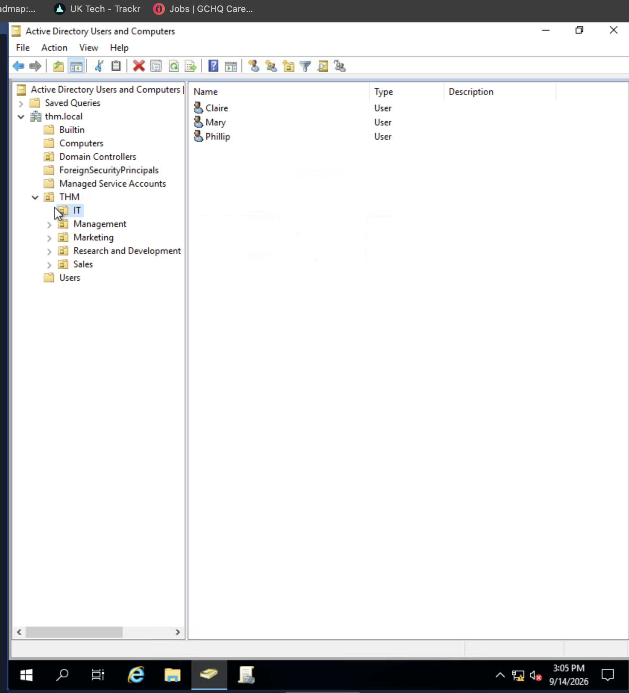
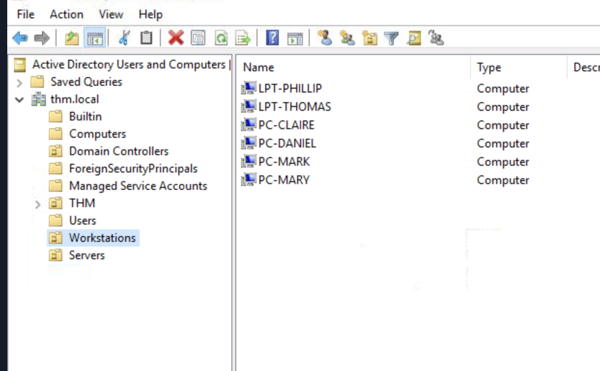
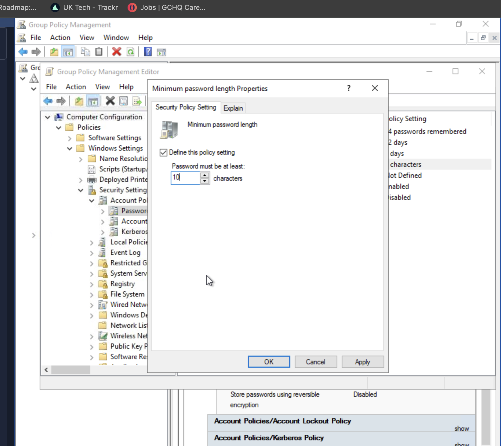
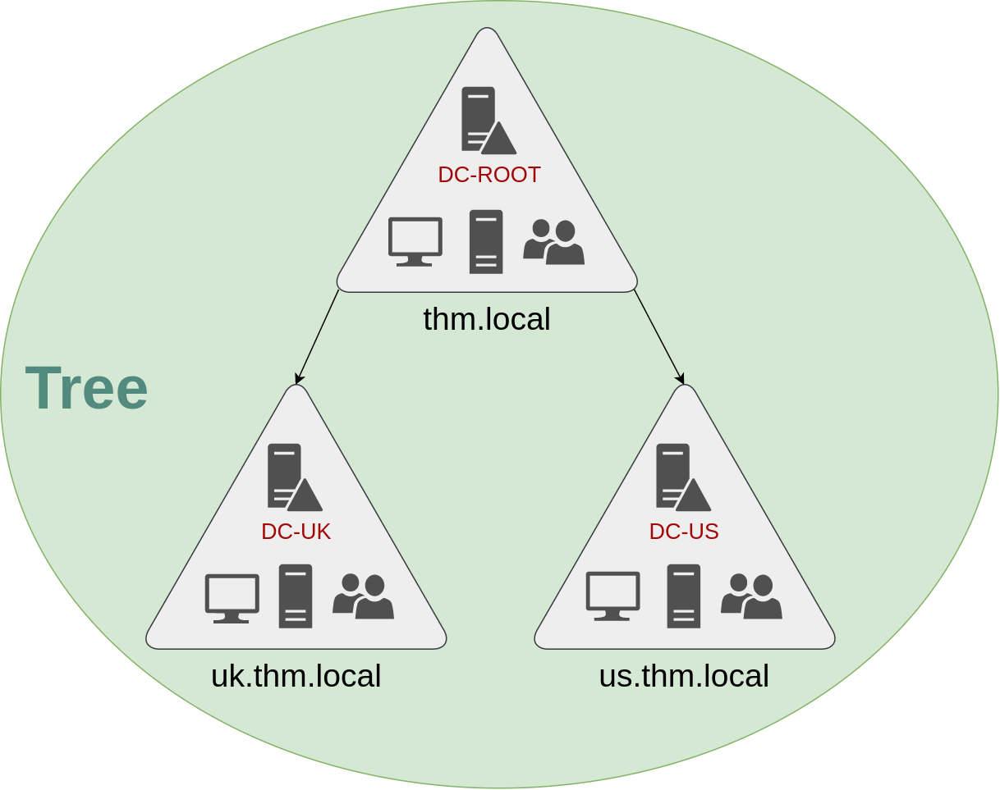
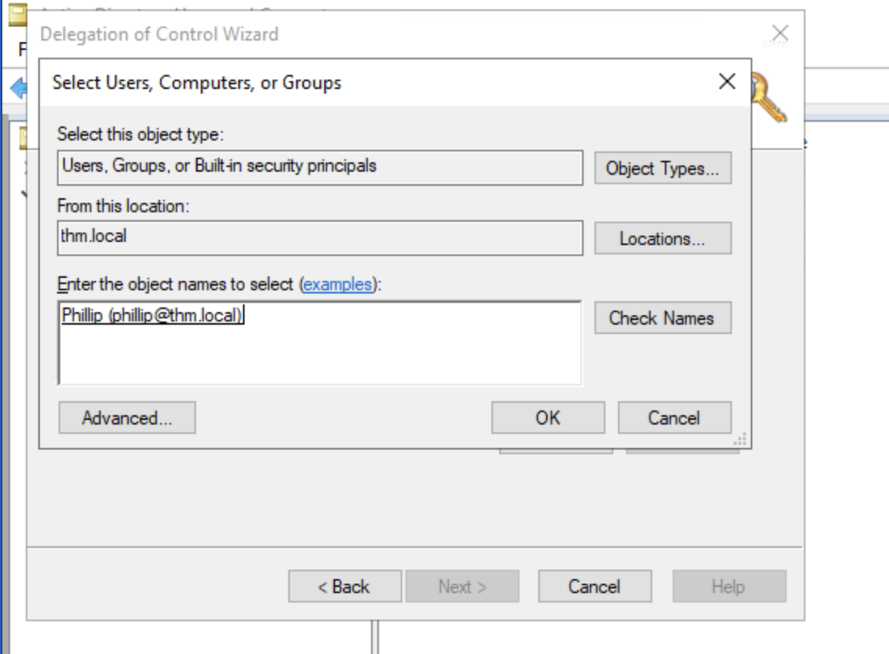
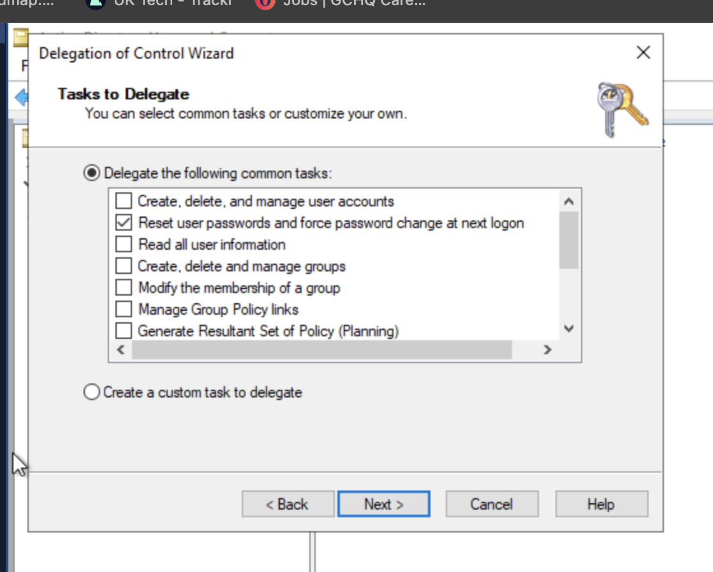

# Windows Fundamentals

## Part 1: File System & Security(11/9/2026)

### NTFS (New Technology File System)

Currently uses **NTFS** instead of FAT or HPFS

**Features:**
- Supports files larger than 4GB
- Set specific permissions on folders and files
- Folder and file compression
- Encryption (Encryption File System - EFS)

### File Permissions

**How to view permissions:**
1. Right-click file/folder
2. View Properties
3. Click on Security tab
4. View permissions and group/user names

### ADS (Alternate Data Streams)

| Aspect | Description |
|--------|-------------|
| Definition | Every file has at least one ADS |
| Purpose | Allows files to contain more than one stream of data |
| Visibility | Windows Explorer doesn't display ADS to users |
| Viewing Tools | 3rd party executables, PowerShell |
| Security Risk | Malware writers use ADS to hide data (hidden HTML tags) |

### System32

- Holds important files that are critical for the operating system

### User & Group Management

**Access via Run:**
- Command: `lusrmgr.msc`
- Shows users and groups
- Displays brief description for each group

### UAC (User Account Control)

- Reduces likelihood of malware successfully compromising your system

---

## Part 2: System Configuration & Management(12/9/2026)

### System Configuration (MSConfig)

**Access via Run:** `MSConfig`

| Tab | Description |
|-----|-------------|
| Services | Lists all services configured for system (running or stopped) |
| Tools | Tools to configure the operating system further |

### Advanced System Settings

**To access:**
1. Open MSConfig
2. Click "View Advanced System Setting"
3. Opens System Properties panel

### UAC Settings Levels

| Level | Description |
|-------|-------------|
| **Always notify** | Highest security - Windows notifies whenever any apps or you try to make changes. Desktop dims (Secure Desktop) |
| **Notify for apps** | Windows notifies only when apps try to make changes, not when you change Windows settings. **Default setting** |
| **Notify without dimming** | Same as "Notify for apps" but screen does NOT dim |
| **Never notify** | Notifications off - Windows won't warn about any changes by you or apps |

### Computer Management

**Three primary sections:**

1. **System Tools**
2. **Storage**
3. **Services and Applications**

#### Task Scheduler
- Create and manage common tasks
- Computer carries out tasks automatically at specified times

#### Event Viewer
- View events that have occurred on the computer
- Acts as an audit trail to understand system activity
- Used to diagnose problems and investigate executed actions

#### Shared Folders
- Complete list of shares and folders
- Shows folders that others can connect to

#### System Information
- **System Summary** divided into three sections:
  1. Hardware Resources
  2. Components
  3. Software Environment

**To find IP Address:**
1. Go to Components
2. Select Network
3. View Adapter
4. See IP address listed

### Resource Monitor (Resmon)

**Overview tab has four sections:**

| Section | Description |
|---------|-------------|
| CPU | Processor usage |
| Disk | Storage and disk activity |
| Network | Network connections and usage |
| Memory | RAM usage |

---

### Command Prompt Commands

| Command | Description |
|---------|-------------|
| `ipconfig` | Show network address settings for the computer |
| `netstat` | Display protocol statistics and current TCP/IP network connections |

### Windows Registry

**Definition:** A central hierarchical database used to store information necessary to configure the system for:
- One or more users
- Applications
- Hardware devices

---# Part 3: Windows Security & Protection

## Update Security

- Check update history (dates of updates)
- View what needs immediate attention


*View of Windows update history showing driver updates and definition updates*

---

## Windows Security

### Overview


*Windows Security main panel showing security status at a glance*

### Virus & Threat Protection

- **Scan Options:**
  - Quick scan - Checks folders where threats are commonly found
  - Full scan - Checks all files and running programs (can take over 1 hour)
  - Custom scan - Choose specific files and locations to check
- View threat history
- Real-time protection
- Cloud-delivered protection
- Automatic sample submission (helps Microsoft protect against threats)
- Controlled folder access
- Exclusions


*Scan options and last scan results showing no threats detected*


*Threat history showing scan results, quarantined threats, and allowed threats*

### Firewall & Network Protection

| Profile | Use Case |
|---------|----------|
| **Domain** | Company/enterprise networks |
| **Private** | Home and trusted networks |
| **Public** | Untrusted public networks (airports, coffee shops) |

### Microsoft Defender SmartScreen

- Protects against phishing websites
- Protects against malware websites

### Device Security

- Core Isolation
- Memory Integrity


*Core Isolation feature showing Memory Integrity protection status*

---

## BitLocker

- Integrated with the operating system
- Addresses threats of data theft
- Full disk encryption

---

## Volume Shadow Copy Service (VSS)

### Overview

- Coordinates required actions to create consistent shadow copy
- Enabled when System Protection is turned ON

### What You Can Do

- Create restore points
- Perform system restore
- Configure restore settings
- Delete restore points

### Security Risk ⚠️

Malware writers specifically target VSS files:
- They delete shadow copy files to prevent recovery
- Makes ransomware recovery **impossible** without offline/off-site backup
- Critical to maintain offline backups

---

# Part 4: Active Directory & Domain Management

## Overview

Active Directory (AD) is Microsoft's centralized management system for Windows networks. It allows administrators to manage users, computers, and security policies from a single repository on a Domain Controller.

---

## What is Active Directory?

**Definition:** A directory service that manages a group of users and computers under administration of a given business.

**Key Component:** Domain Controller (DC) - The server that runs Active Directory and stores all domain information.

---

## Benefits of Active Directory

### Centralized Identity Management
- All users across the network can be configured from AD with minimum effort
- One place to manage all domain accounts

### Centralized Security Policy Management
- Configure security policies directly from AD
- Apply policies consistently across the domain
- Use security groups to grant permissions

---

## AD Components

### Security Groups
- **Domain Admins** - Have admin privileges over the entire domain
- **Server Operators** - Can admin Domain Controller but can't change admin group memberships
- Custom security groups for resource permissions

### Organizational Units (OUs)
- Handy for applying policies to specific groups of users/computers
- Allows hierarchical organization of domain objects

### Delegation
- Grant users specific privileges to perform tasks without full Domain Admin access
- Useful for decentralized administration

---

## Authentication Protocols

### Kerberos (Modern)
- Default protocol in recent Windows versions
- More secure than legacy authentication

### NetNTLM (Legacy)
- Kept for compatibility with older systems
- Should be avoided for new implementations

---

## Group Policy Objects (GPOs)

### Distribution
- GPOs are stored in SYSVOL share on Domain Controllers
- Default path: `C:\Windows\SYSVOL\sysvol\`
- All domain users have access for syncing

### Update Timing
- Changes can take up to **2 hours** to propagate
- Force immediate sync with:
```powershell
  gpupdate /force
```

### Management
- Centralized control of user and computer configurations
- Applied based on OU hierarchy

---

## Active Directory Setup & Configuration


*Initial Active Directory environment configuration*

### Creating Organizational Units


*Process of creating a new Organizational Unit for policy management*

### Configuring Policies


*Setting password length requirements via Group Policy*

### Domain Tree Structure


*Hierarchical structure of users and computers in the domain*

---

## Delegation & Access Control

### Setting Up Delegation


*Initial delegation configuration for user privileges*

### Delegation Details


*Detailed view of delegated permissions and access rights*

### Enabling Access


*Configuring access permissions for delegated users*

---

## Key Takeaways

✅ AD centralizes user and computer management  
✅ GPOs enforce security policies across the domain  
✅ Kerberos is the modern authentication standard  
✅ Delegation allows secure decentralized administration  
✅ SYSVOL stores and distributes GPO updates  

---

**Last Updated:** 2026-09-14  
**Status:** 📚 Active Learning
